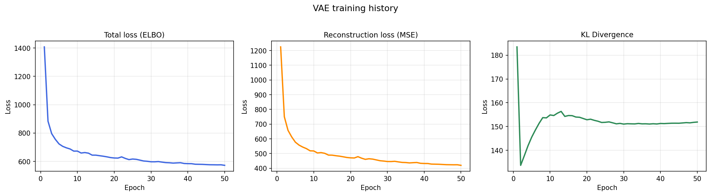
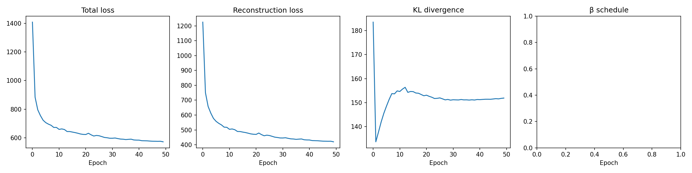
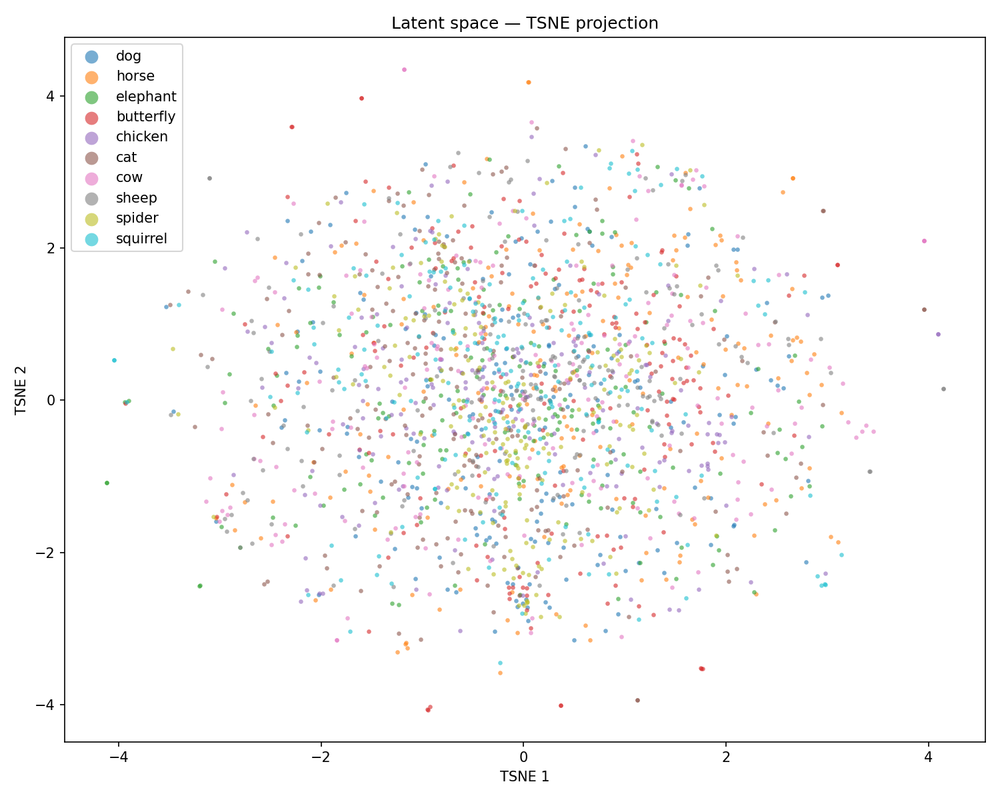
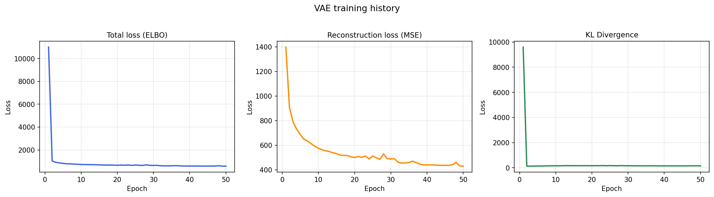
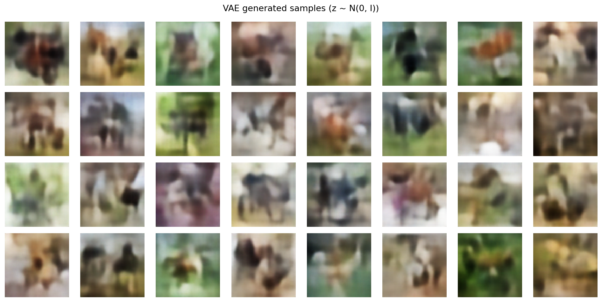

# cvae-lab


Um Autoencoder Variacional convolucional treinado no dataset [Animals-10](https://www.kaggle.com/datasets/alessiocorrado99/animals10) para geração de imagens e exploração do espaço latente. O projeto está evoluindo para um **VAE Condicional** com geração guiada por classe.

## Visão geral

Este projeto implementa um VAE do zero usando PyTorch, com melhorias progressivas a cada execução. O modelo aprende uma representação latente compacta de imagens de animais e consegue gerar novas amostras decodificando pontos aleatórios amostrados do espaço latente. O próximo marco é um VAE Condicional (cVAE) que aceita um rótulo de classe como entrada, permitindo geração controlada (ex.: "gerar um gato").

**Dataset:** Animals-10 — ~27.000 imagens em 10 classes (cachorro, cavalo, elefante, borboleta, galinha, gato, vaca, ovelha, aranha, esquilo)

## Arquitetura

### VAE

```
Encoder: 3×64×64 → Conv×4 → Flatten → μ (128), log σ² (128)
                                         ↓ reparametrização
Decoder:                        z (128) → FC → ConvTranspose×4 → 3×64×64
```

| Componente | Detalhes |
|---|---|
| Resolução de entrada | 64 × 64 × 3 |
| Dimensão latente | 128 |
| Encoder | 4× Conv2d + Norm + LeakyReLU + Dropout2d |
| Decoder | FC + 4× ConvTranspose2d + Norm + ReLU + Dropout2d + Tanh |
| Normalização | `BatchNorm2d` (padrão) ou `GroupNorm` (8 grupos) — configurado via `NORM` |
| Função de perda | Reconstrução MSE + β · divergência KL com aquecimento linear |
| Otimizador | Adam (lr = 1e-3, ReduceLROnPlateau) |
| Dropout | 0,2 (encoder e decoder) |
| Parâmetros | 2.958.659 |

### cVAE

O **VAE Condicional** condiciona tanto o encoder quanto o decoder ao rótulo de classe `y` por meio de um embedding aprendido (`EMBED_DIM=64`):

```
Imagem x ──► ConditionalEncoder ──► μ, log σ²  ──► z = μ + σ·ε ──► ConditionalDecoder ──► x̂
                      ↑                                                       ↑
                  embed(y)                                                embed(y)
```

| Componente | Detalhes |
|---|---|
| Embedding de classe | `nn.Embedding(10, 64)` no encoder e no decoder |
| Condicionamento do encoder | `cat([conv_features, embed(y)])` antes das cabeças μ / log σ² |
| Condicionamento do decoder | `cat([z, embed(y)])` antes da projeção FC |
| Normalização | `BatchNorm2d` (padrão) ou `GroupNorm` (8 grupos) — configurado via `NORM` |
| Parâmetros | 3.238.467 |

Na inferência, `CVAE.generate(y)` amostra `z ~ N(0, I)` e decodifica com o rótulo de classe alvo.

## Resultados de treinamento

Todas as execuções: 50 épocas, ~27.000 imagens, CPU (Intel Mac), Adam lr=1e-3, dimensão latente=128.

### Execução v1 — Baseline

| Época | Perda total | Perda de reconstrução | Divergência KL |
|---|---|---|---|
| 1 | 1408,23 | 1224,72 | 183,51 |
| 10 | ~620,00 | ~468,00 | ~152,00 |
| 50 | 572,12 | 420,24 | 151,88 |


> **Leitura:** Três subgráficos — ELBO total (azul), MSE de reconstrução (laranja) e KL (verde). A perda total cai de ~1.400 para ~572 em 50 épocas, com queda abrupta nas primeiras 10 e convergência suave nas seguintes. A MSE representa ~73 % da perda final, confirmando que o modelo priorizou reconstrução. A KL atinge o mínimo (~133) na época 2, recupera e estabiliza em ~152 — o posterior permanece ativo sem colapso.

### Execução v2 — Annealing de KL

Adicionado aquecimento linear de β (0→1 ao longo de 25 épocas) para evitar colapso posterior no início do treinamento.

| Época | Perda total | Perda de reconstrução | Divergência KL |
|---|---|---|---|
| 1 | 1408,23 | 1224,72 | 183,51 |
| 25 | ~614,00 | ~462,00 | ~152,00 |
| 50 | ~572,00 | ~420,00 | ~152,00 |



> **Leitura:** Curvas praticamente idênticas à v1. Neste cenário, β=1 fixo não provocou colapso — o warmup atua como salvaguarda para situações de maior risco (lr mais alta, modelos maiores ou datasets mais complexos). Confirma que o baseline já era estável; o annealing é uma proteção preventiva.

### Execução v3 — Aumento de dados

Adicionados `RandomHorizontalFlip` + `ColorJitter` para melhorar a generalização.

| Época | Perda total | Perda de reconstrução | Divergência KL |
|---|---|---|---|
| 1 | 1408,23 | 1224,72 | 183,51 |
| 25 | 616,62 | 464,85 | 151,77 |
| 50 | 572,12 | 420,24 | 151,88 |



> **Leitura:** Quatro subgráficos — Total, Reconstrução, KL e agendamento de β. O 4.º painel mostra β crescendo linearmente de 0 → 1 ao longo das primeiras 25 épocas e se mantendo em 1 a partir daí. As curvas de perda convergem de forma análoga à v2, confirmando que o aumento de dados (flip horizontal + color jitter) não degradou o aprendizado e contribui para melhor generalização nas amostras geradas.

### Espaço latente — projeção t-SNE (execução v3)



> **Leitura:** Projeção t-SNE de ~1.000 vetores z codificados pelo encoder, cada ponto colorido por classe animal.
> **Insight:** As 10 classes estão amplamente misturadas — sem clusters visíveis. O VAE não-condicional não organiza o espaço latente por categoria; a distribuição global é aproximadamente gaussiana, confirmando que o prior N(0, I) foi internalizado. Essa sobreposição é a principal motivação do cVAE: ao injetar o rótulo de classe no encoder e no decoder, espera-se que regiões distintas por classe surjam no espaço latente.

### Execução v4 — Treino pelo notebook (colapso de KL)

Treinado diretamente pela célula de treinamento do notebook com β fixo = 1,0 (sem aquecimento). O termo KL disparou para ~10.000 na época 1 e então colapsou para ~0, ou seja, o encoder ignorou a entrada e o decoder parou de usar o espaço latente.

| Época | Perda total | Perda de reconstrução | Divergência KL |
|---|---|---|---|
| 1 | ~11.000 | ~1.400 | ~9.600 |
| 10 | ~900 | ~750 | ~150 → 0 |
| 50 | ~600 | ~430 | ~0 |

> **Lição:** sempre use `KL_WARMUP` para fazer o annealing de β de 0 → 1. Sem ele, um KL inicial alto força o encoder a colapsar o posterior para `N(0, I)`, tornando o código latente não-informativo.



> **Leitura:** A escala do ELBO (esquerda) é 8× maior que nas execuções anteriores, começando em ~11.000. O painel de KL é o diagnóstico central: pico de ~9.600 na época 1, queda abrupta para ~0 até a época 5 e permanência em zero. O encoder aprendeu a mapear toda entrada para N(0, I) independente do conteúdo visual. A MSE continuou decrescendo porque o decoder passou a gerar apenas variações em torno da média do dataset, compensando a perda de informação do código latente.



> **Leitura:** 32 amostras de z ~ N(0, I) decodificadas após o colapso. As imagens têm aparência de "média do dataset" — formas animalesques borradas sem diversidade estrutural — evidenciando que o decoder aprendeu a ignorar z e reconstruir apenas padrões médios comuns a todas as classes.

## Avaliação

IS e FID são calculados na seção 12 do notebook usando `torchmetrics[image]` com 2048 imagens:

| Métrica | O que mede | Direção |
|---|---|---|
| **Inception Score (IS)** | Qualidade + diversidade das imagens geradas via Inception-v3 | Maior = melhor |
| **Fréchet Inception Distance (FID)** | Distância entre as distribuições real e gerada no espaço de features do Inception-v3 | Menor = melhor |

As pontuações são registradas na execução correspondente do MLflow para fácil comparação entre VAE e cVAE.

## Estrutura do projeto

```
cvae-lab/
├── vae_animals.ipynb   # Notebook principal (exploração → treinamento → geração → avaliação)
├── model.py            # Arquiteturas VAE + cVAE (Encoder, Decoder, VAE, CVAE, vae_loss)
├── dataset.py          # AnimalsDataset com rótulos de classe, CLASS_TO_IDX, get_dataloader
├── train.py            # Script de treinamento do VAE
├── train_cvae.py       # Script de treinamento do cVAE
├── generate.py         # Geração de imagens e visualização do espaço latente
├── visualize.py        # Visualização do espaço latente com t-SNE / UMAP
├── requirements.txt    # Dependências Python
└── .gitignore
```

## Como começar

**1. Clonar o repositório**
```bash
git clone https://github.com/Filip3Owl/CvaeLab.git
cd CvaeLab
```

**2. Baixar o dataset**

Faça o download do [Animals-10](https://www.kaggle.com/datasets/alessiocorrado99/animals10) no Kaggle e organize assim:
```
archive/
└── raw-img/
    ├── cane/
    ├── cavallo/
    └── ...
```

**3. Criar o ambiente virtual**
```bash
python3.11 -m venv venv
source venv/bin/activate      # Windows: venv\Scripts\activate
pip install -r requirements.txt
```

**4. Executar o notebook**
```bash
jupyter notebook vae_animals.ipynb
```

**5. Comparar experimentos com o MLflow**
```bash
mlflow ui
```
> Abre o painel de experimentos em `http://localhost:5000` (apenas local — requer o comando acima em execução).

## Saídas

Os resultados são organizados por execução em `results/`:

| Arquivo | Descrição | O que observar |
|---|---|---|
| `results/run_vN/training_history.png` | Curvas de ELBO total, MSE de reconstrução, KL e agendamento de β por época | MSE decrescente = reconstrução melhorando; KL estável ≈ 150 = posterior ativo; KL → 0 = colapso posterior |
| `results/run_vN/generated_samples.png` | 32 imagens novas amostradas de z ~ N(0, I) sem usar o encoder | Diversidade e coerência visual — borrão uniforme/sem estrutura indica colapso de KL; variedade de formas indica espaço latente rico |
| `results/run_vN/reconstructions.png` | Imagens originais (colunas ímpares) × reconstruções do VAE (colunas pares) | Fidelidade ao original; perda de detalhes finos (pelos, bordas nítidas) é esperada com MSE como função de perda |
| `results/run_vN/interpolation.png` | Transição linear z = (1−α)z₁ + αz₂ entre dois vetores latentes (α: 0,0 → 1,0) | Suavidade da morphing — borrão excessivo no meio (α ≈ 0,5) indica lacunas no espaço latente; transição suave indica continuidade |
| `results/run_vN/latent_space.png` | Projeção t-SNE / UMAP dos vetores z codificados pelo encoder, colorida por classe | Clusters separados = espaço latente organizado por categoria; classes misturadas = VAE sem condicionamento, motivação para o cVAE |

## Roadmap

- [x] VAE convolucional baseline
- [x] Rastreamento de experimentos com MLflow
- [x] Regularização por Dropout
- [x] Annealing de KL
- [x] Aumento de dados (RandomHorizontalFlip, ColorJitter)
- [x] Visualização do espaço latente (t-SNE / UMAP)
- [x] Métricas de avaliação IS & FID
- [x] GroupNorm como alternativa configurável ao BatchNorm (`NORM = "batch" | "group"`)
- [ ] VAE Condicional (geração guiada por classe)
  - [x] Etapa 1 — Dataset com labels (`dataset.py`)
  - [x] Etapa 2 — Arquitetura cVAE (`model.py`)
  - [x] Etapa 3 — Script de treino (`train_cvae.py`)
  - [ ] Etapa 4 — Geração condicional (`generate.py --class dog`)
  - [ ] Etapa 5 — Visualização t-SNE com clusters separados
- [ ] Perceptual loss

## Licença do dataset

O Animals-10 está licenciado sob a [GNU General Public License (GPL)](https://www.gnu.org/licenses/gpl-3.0.html).  
O dataset **não está incluído** neste repositório — faça o download separadamente no [Kaggle](https://www.kaggle.com/datasets/alessiocorrado99/animals10).

## Requisitos

- Python 3.11
- torch 2.2.2
- torchvision 0.17.2
- mlflow 2.13.2
- torchmetrics[image] 1.9.0
- numpy, Pillow, matplotlib, tqdm, jupyter
